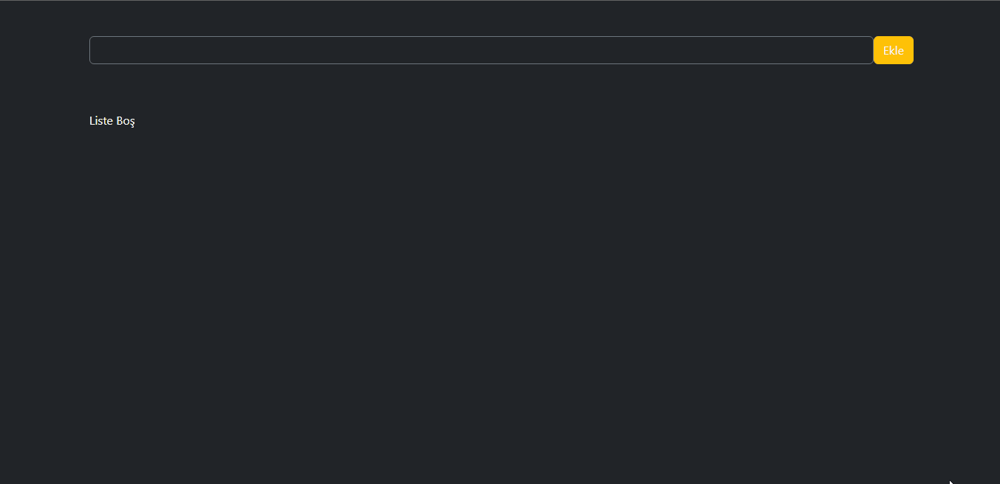

# REACT- REDUX TODO-APP

This project was bootstrapped with [Create React App](https://github.com/facebook/create-react-app).

## Used Technologies

 React-Redux DB.JSON Axios 

### Created TodoApp with React-Redux , Db.Json and API serve synchronously. Todos in the form of a card, delete and complete commands , date and progress text.

